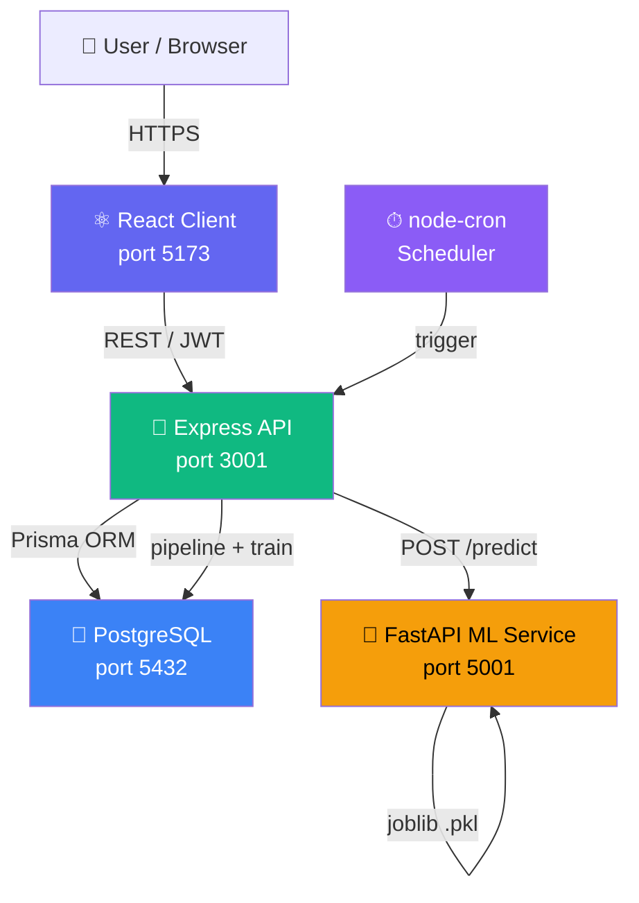

# System Architecture



## Data Flow

```
1. Usher logs attendance (POST /api/attendance)
        ↓ Prisma → Attendance table
2. Member submits feedback (POST /api/feedback)
        ↓ Prisma → Feedback table
3. Pipeline (ml/pipeline.py, triggered manually or by cron)
        ↓ Reads Attendance + Feedback
        ↓ Computes rolling average, slope, RSVP rate, feedback avg
        → Writes to Feature table
4. Training (ml/train.py)
        ↓ Reads Feature + Attendance (joined)
        ↓ TimeSeriesSplit GridSearchCV SVR
        → Saves ml/models/group_<id>.pkl
5. Forecast request (GET /api/forecast?group=1)
        ↓ Express reads latest Feature row for group
        ↓ Calls FastAPI: POST http://localhost:5001/predict
        ↓ FastAPI loads .pkl → predicts → bootstrap CI
        → Express persists Forecast + optional Alert
6. Dashboard (React ForecastPage)
        → Renders historical line + CI band + forecast point (Recharts)
        → AlertBanner shown if alertType = drop/growth
```

## Role-Based Access Control

| Endpoint | admin | pastor | usher | member |
|----------|-------|--------|-------|--------|
| GET /api/groups | ✅ | ✅ | ✅ | ✅ |
| POST /api/groups | ✅ | ❌ | ❌ | ❌ |
| POST /api/attendance | ✅ | ❌ | ✅ | ❌ |
| POST /api/feedback | ✅ | ❌ | ✅ | ✅ |
| GET /api/forecast | ✅ | ✅ | ❌ | ❌ |
| GET /api/alerts | ✅ | ✅ | ❌ | ❌ |
| PATCH /api/alerts/:id/acknowledge | ✅ | ✅ | ❌ | ❌ |
